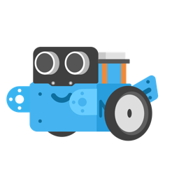

# mbot-controller
Simple iOS app acts as a proxy between gamepad and mBot. It works on the original [Makeblock mBot Protocol](http://learn.makeblock.com/en/makeblock-orion-protocol/) so there is no need to do anything additional on mBot side if appropriate firmware is installed.



## Requirements
* [mBot](https://store.makeblock.com/products/makeblock-mbot-diy-programming-robot) kit with bluetooth
* iOS supported remote controller (I used PS4 controller)
* BLE supported iOS device (e.g. iPhone)
* [XCode](https://apps.apple.com/app/xcode/id497799835)
* [CocoaPods](https://cocoapods.org)

## Installation
Check out the source 
```bash
git clone https://github.com/renjfk/mbot-controller.git
```
initiate pod project using CocoaPods
```bash
pod install
```
then open generated project (`MBot.xcworkspace`) using XCode and run on your device.

## Usage
### Screenshot from App


### Controls
To connect to mBot click on the `Connect to robot` this will start bluetooth scanning and connect to first available device starting with `Makeblock_`.

For gamepad you need to pair one on your device first (PS4 controller you can enable pairing mode by pressing and holding PS and Share buttons at the same time and then pair on your device using bluetooth settings) and then click on the `Connect to controller`.

### Features
* Left thumbstick is mapped to motor controls considering analog values
* `X`, `Y`, `A`, `B`, `L1`, `L2`, `R1`, `R2` buttons make notes on the buzzer as well as random RGB light on the board
* If the device front is close to an obstacle it will disable controls and step back from it with funny movements
 